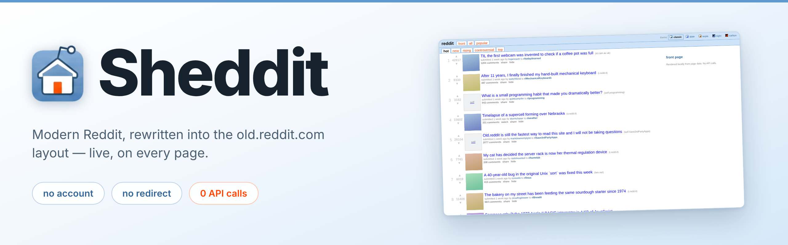
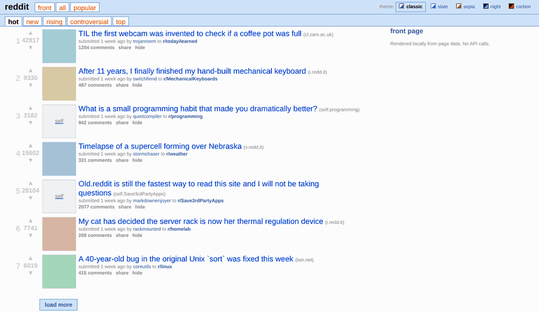
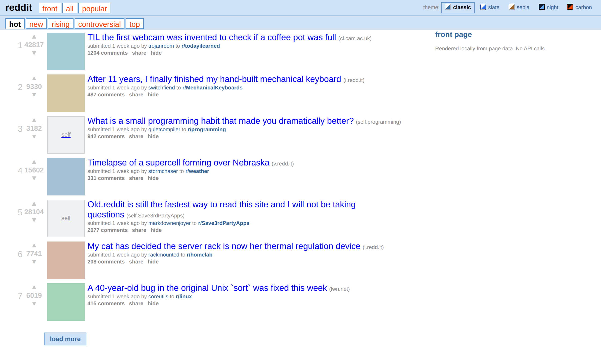
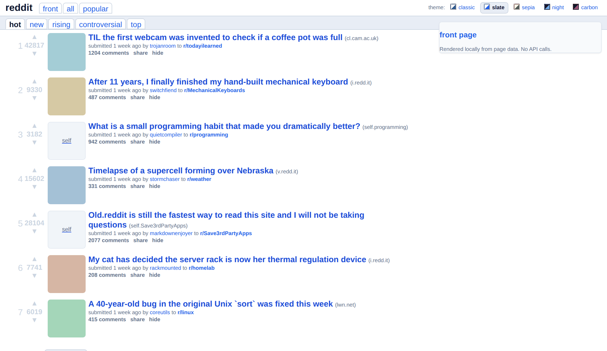
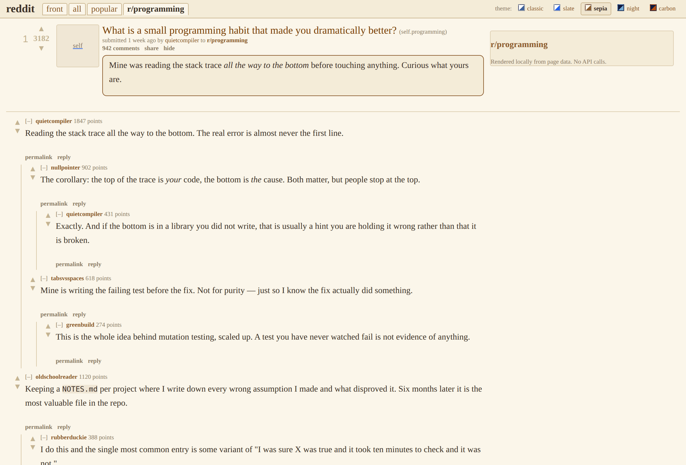
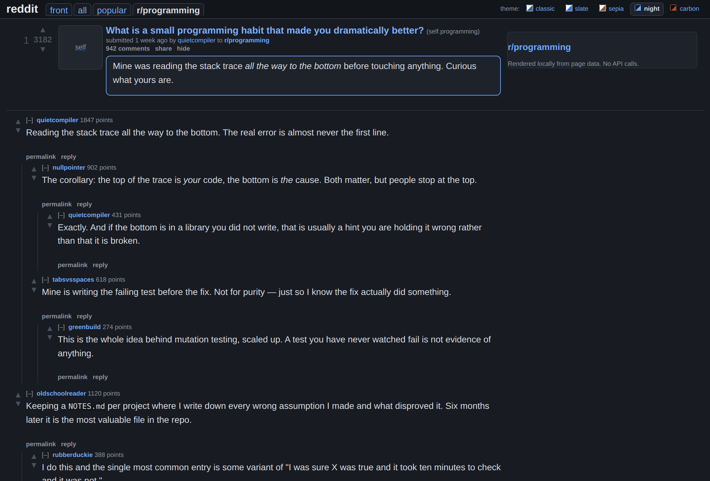
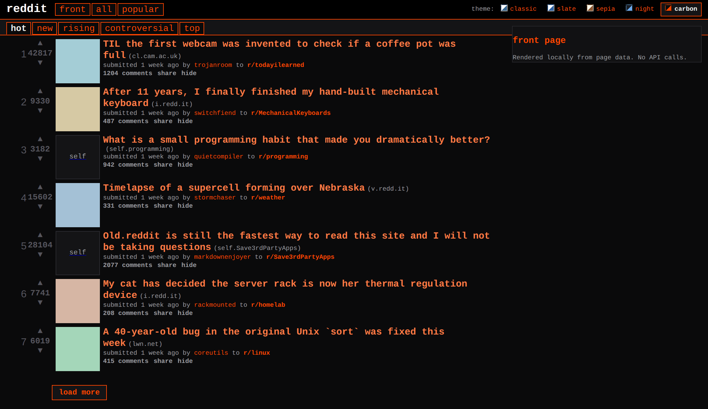

<div align="center">

<picture>
  <source media="(prefers-color-scheme: dark)" srcset="docs/assets/banner-dark.png">
  <source media="(prefers-color-scheme: light)" srcset="docs/assets/banner-light.png">
  
</picture>

### Shed the manipulative endless feed. Keep the conversation.

**Read Reddit without being read back.**

Stay logged out, unprofiled, un-manipulated.

[](#why)
[](#why)
[](#privacy)
[](#privacy)
[](#privacy)
[](#why)

[](CHANGELOG.md)
[](manifest.json)
[](#install)
[](#firefox)
[](LICENSE)

### Beta 0.25.0 is out — everyone is welcome to try it

If Sheddit improves your browsing experience, please help spread the word — share it with
friends, on social media, or on Reddit itself (if you still have an account ;)

Both browsers, [installed by hand](#install) in about a minute.
**[Bug reports](https://github.com/kookaburrabarrel/sheddit/issues/new/choose) are
genuinely wanted** — Reddit can rename its markup without notice, so a report from a page
that broke is the fastest way it gets fixed. [What changed](CHANGELOG.md).

<br>

**Five ways to read it, all of them content to let you leave — and none of them watching you read.**



</div>

---

## Why

Old Reddit was dense, fast, and got out of your way — a page of ranked links you could
scan and pick from; what replaced it is built for scrolling, a slot machine's psychology
applied to a link aggregator with a data harvesting apparatus built on top. Every pause,
expansion, return visit and comment is harvested into a profile; the profile is what
advertisers buy; and your feed is ranked against that profile to keep the session going —
one more scroll, one more belief reinforcement, one more outrage, one more product
placement. It's a cynical lesson learned from Facebook and TikTok — a session that ends
is a session that stops producing.

The sentiment manipulation and almost all the data harvesting needs you logged in.
Identity is what ties every scroll and
hesitation to one durable profile that follows you across devices and years; logged out,
the data scatters and the profile thins. Which may be why logged-out reading keeps
getting harder: a login wall that raises itself half a minute into reading, with no close
button and no way to dismiss it; `old.reddit.com` vanishing behind account requirements
for days at a stretch, with no announcement; the anonymous JSON API gated off entirely.
Whatever the intent, the effect is the same: reading without an account keeps getting
narrower.

**Sheddit is the opt-out.** It takes the page Reddit already sent your browser and
re-renders it locally into old reddit's layout — no account, no credentials, and zero API
calls of its own. What you read is the list Reddit serves to a stranger: ranked by votes,
not by your profile, because there is no profile. The login wall is removed outright
rather than negotiated with. Nothing is recommended *to you*, nothing is harvested *from
you*, and the session ends when you decide it does.

What's left is a ranked list of links that stops when you do. Everything below is about
keeping it working on a site that has no reason to help.

### Three ways to get old Reddit back, and why this one

|  | Works logged out | Needs your credentials | Survives an API policy change |
|---|:---:|:---:|:---:|
| **Redirect** to `old.reddit.com` | 🔴 not for long | 🔴 soon | 🔴 n/a — depends on Reddit continuing to host it |
| **Rebuild from the JSON API** | 🔴 no | 🔴 yes | 🔴 no |
| **Rebuild from the page** ← Sheddit | 🟢 yes | 🟢 no | 🟢 yes |

Redirecting is the simplest thing that works, while it still works. `old.reddit.com` is
being phased out in stages, and the current stage is random, full-site login walls — no
pattern, no announcement, logged-out access just stops for a stretch and comes back
later. This project's own measurements already caught the milder version of the same
thing: a long unreachable spell that lifted with no notice. A redirect extension inherits
whatever `old.reddit.com` decides on a given day, and the direction of travel is an
account requirement for any access at all — the pressure described [above](#why), applied
to the one refuge a redirect depends on.

Rebuilding from Reddit's JSON API gets you real old-Reddit markup, but it rides your
logged-in session — the [Classic Layout][cl] project documents needing an authenticated
session because Reddit gates the anonymous `.json` endpoint, which means logged-out
readers get a `403` and nothing renders.

Sheddit takes the third route. Everything it needs is already in the page Reddit just
sent you: `<shreddit-post>` elements carry the title, score, author, permalink and comment
count as plain HTML attributes. Sheddit reads those and draws its own markup, which leaves
nothing to revoke, expire, or log into.

The catch is that Reddit can quietly rename those attributes whenever it likes and owes
nobody notice when it does. That's why this project is meant to be free, open-source, and
collaborative. When they change something, so will we.

[cl]: https://github.com/mkornreich/old_reddit

## How it's tested

It runs on every Reddit page you open, and for now you install it by hand rather than from
a store. Here is the testing behind it.

**Six suites**, each catching what the cheaper one below it cannot:

| Suite | Runs on | Catches |
|---|---|---|
| `css-lint` | the stylesheets, statically | uncontained floats, column arithmetic, theme drift |
| `run` | the bundle in jsdom | structure, routing, idempotency, delegation |
| `geometry` | **real layout** in headless Chromium | overlap, wrapping, floats, every theme at two widths |
| `extension` | the **packed extension** in Chromium | manifest wiring, script worlds, CSS delivery order |
| `extension-firefox` | the **Firefox build** in a real Firefox | Gecko's stricter realm boundary, the derived manifest, SPA routing with no `navigation` API |
| `media-sync` | real media playback in Chromium | the video player's audio pairing — jsdom has no media pipeline at all |

**Mutation testing.** A passing test proves nothing until you have watched it fail.
`npm run test:mutate` reintroduces every bug this project has shipped, one at a time, and
fails if the suite stays green. It has caught assertions that protected nothing at all.

**A written record of every bug.** [docs/engineering-log.md](docs/engineering-log.md)
gives every one a numbered entry describing *what the wrong behaviour looked like* rather
than just what changed — because that is what makes a bug recognisable when someone is about to
reintroduce it.

Two of those entries are why `geometry` and `extension` exist as separate suites rather
than more assertions bolted onto `run`:

- **jsdom does no layout.** The suite passed 39/39 while the page rendered visibly wrong.
  That is what `geometry` catches.
- **Content scripts don't share Reddit's JavaScript realm.** Infinite scroll was broken in
  every *installed* copy of the extension while the dev harness paginated happily — because
  pasting into DevTools runs in a different world. That is what `extension` catches.

A third entry applies the same care to a design decision. Reddit blurs adult thumbnails
for logged-out readers, and Sheddit renders its own `` straight from the URL rather
than Reddit's — which is why those thumbnails fall back to old Reddit's placeholder tile
(see [Scope](#scope)) instead of the raw image.

## Install

> ### Current version: **0.25.0** — beta, open to everyone
> Both downloads below are this version. It is a beta in the honest sense: it works, it
> is tested on both browsers — Chrome the more thoroughly of the two — and Reddit can
> still change something tomorrow that breaks it. If that happens,
> [tell me](https://github.com/kookaburrabarrel/sheddit/issues/new/choose) — bug reports
> are appreciated and acted on.
>
> After installing, the extension's own failure screen prints the version it is running —
> the way to tell whether a reload actually took. [What changed](CHANGELOG.md).

Chrome and Firefox run the same source. **The Chrome build is the further along of the
two** — it is what most of the development and live testing has run against, and its
store listing is already in review. Firefox support arrived in 0.24.0: it passes its own
suite against a real Firefox and works in normal use, but it has far less mileage on real
pages, so that is where a rough edge is likeliest to turn up. Until the listings land,
the zips below are the easiest way in — nothing to build.

### Chrome

**[⬇ Download sheddit.zip](https://github.com/kookaburrabarrel/sheddit/raw/main/dist/sheddit.zip)**

1. Unzip it. You get a `sheddit` folder with `manifest.json` inside.
2. **Move that folder somewhere permanent** — Documents is fine. Chrome re-reads the
   extension from wherever you leave it every time it starts, so a folder still sitting in
   Downloads will take Sheddit with it the day you clear Downloads.
3. Open `chrome://extensions`
4. Turn on **Developer mode**, top right
5. Click **Load unpacked** and pick the folder with `manifest.json` *directly* inside it —
   not a folder containing that folder, which is the one mistake worth watching for
6. Open [reddit.com](https://www.reddit.com)

Chrome will warn about developer-mode extensions each time it starts. It says that about
anything installed outside the Web Store; dismiss it and Sheddit keeps running.

**To update:** download the zip again, replace the folder's contents, then press ↻ on the
Sheddit card in `chrome://extensions`. Chrome keeps running the copy it read at load time,
so without the ↻ you are still on the old build — the failure screen prints the version if
you need to check which one you are looking at.

### From source

For contributors, or anyone who would rather read the source first:

```bash
git clone https://github.com/kookaburrabarrel/sheddit.git
```

Then the same steps: `chrome://extensions` → **Developer mode** → **Load unpacked** → the
cloned folder. There is no build step to run first.

> **Try it without installing anything.** `npm install && npm run preview` writes
> `dist/preview.listing.html` and `dist/preview.comments.html` — the actual renderer's
> output, openable in any browser.

Requires Chrome 111+ or any Chromium browser (Edge, Brave, Vivaldi, Opera), or
Firefox 128+ — see below.

### Firefox

**[⬇ Download sheddit-firefox.zip](https://github.com/kookaburrabarrel/sheddit/raw/main/dist/sheddit-firefox.zip)**

Same extension, same source; only the manifest differs, and it is generated from
Chrome's rather than maintained separately. It is the **younger** of the two builds —
shipped in 0.24.0, with its own test suite driving a real Firefox, but without the
months of live use behind the Chrome one, so bug reports from here are especially
useful. An addons.mozilla.org listing is the durable way in once it lands; until then
Firefox only accepts an unsigned extension as a *temporary* install, which lasts until
the browser closes:

1. Open `about:debugging#/runtime/this-firefox`.
2. **Load Temporary Add-on…** and pick the downloaded zip (no need to unzip).

Two Firefox notes. Firefox can revoke a site permission at any time — if reddit.com ever
loads without the layout, open the extension's options page: it will say so and offer a
button to grant access back. And Firefox needs to be version 128 or newer, which is the
oldest ESR.

## What it does

|  |  |
|---|---|
| **The whole list at once** | 72px rows with rank, score, thumbnail, subreddit and tagline — around nine posts in a 1280×800 window, growing a line where a title needs one |
| **Threading that reads like a conversation** | Depth-indented comment trees with guide lines and `[–]` collapse toggles, rebuilt from Reddit's own depth data — with old reddit's sort menu and `all N comments` link above them |
| **Media without leaving the layout** | Video plays on the comments page, sound included; images and gallery frames render full size there too, and listing rows get old reddit's `[+]` expando |
| **Scrolling that ends** | Drives Reddit's own pagination and stops when the feed is spent, instead of spinning to keep the session open |
| **Five themes, no reload** | Switched from a button in the header; the choice follows you to every other tab |
| **Tells you when it breaks** | If Reddit ships markup Sheddit can't read, you get a screen saying so, with a button to hand the page back |
| **Nothing leaves your browser** | No API calls and no telemetry; your settings are kept in your browser's own storage and go nowhere else |

## Themes

Five palettes, switched from buttons in Sheddit's own header. A theme changes colour, type
and vertical rhythm — never the column layout, which the test suite proves by laying every
theme out at 360px and 1280px and asserting that no row moves. The theme is applied
*before* first paint, so a dark theme never opens on a white flash.

<div align="center">

| classic | slate |
|:---:|:---:|
|  |  |
| old.reddit.com as it was — Verdana, blue links, square corners | the same layout softened — system font, muted greys, roomier rows |

| sepia | night |
|:---:|:---:|
|  |  |
| warm paper and serif type, for a long thread | dark, and deliberately softer than white-on-black |

| carbon |
|:---:|
|  |
| near-black, monospaced, Reddit orange, dense |

</div>

## How it works

Reddit's `<shreddit-post>` elements carry **the entire post record as HTML attributes** —
`post-title`, `score`, `comment-count`, `author`, `permalink`, `subreddit-name`,
`created-timestamp`, and more. Meanwhile most of its child components sit behind shadow
roots: a single post carries 21 open ones, and page CSS reaches into none of them. That is
why every attempt to restyle modern Reddit with a stylesheet stalls out: whatever the
reason for the encapsulation, the markup a stylesheet would need is on the other side of
it.

So Sheddit leaves Reddit's DOM alone. It reads those attributes, renders its own
old-reddit markup into a root of its own, and hides the native tree. A `MutationObserver`
keeps doing it as content streams in.

```
<shreddit-post post-title="…" score="12247" comment-count="1270" …>
        │
        ▼   read the attributes
   ┌─────────────┐
   │  model.js   │  →  a plain object
   └─────────────┘
        │
        ▼   render Sheddit's own markup
   ┌─────────────┐
   │ listing.js  │  →  <div class="thing link">…</div>
   └─────────────┘
        │
        ▼   hide the original
   suppress.css
```

Every Reddit selector and attribute name lives in one file, `src/config/contracts.js` — so
a Reddit redesign should only ever break one file. The full reasoning is in
**[ARCHITECTURE.md](ARCHITECTURE.md)**.

## Scope

**Built for logged-out reading.** That is the primary case and the one everything is tested
against. What follows from that, stated plainly:

- **Voting isn't supported.** The arrows are drawn because old Reddit drew them,
  and they still delegate to Reddit's own controls — but the native upvote button is
  confirmed unreachable for a logged-out session. Treat them as decorative.
- **Anything needing a session is left out.** `save` and `report` were removed: they can
  never work logged out, and shipping them as links to the permalink made them look like
  actions. Old Reddit didn't offer them logged out either.
- **Adult thumbnails show old Reddit's `nsfw` placeholder**, with the same opt-in old Reddit
  had — see the note on adult thumbnails under *How it's tested* for the reasoning.
- **Pages with no feed are handed straight back.** Age gates, private communities and
  rate-limit pages are recognised and left alone, immediately. Putting an error screen over
  an age gate would cover the button you need to press.

**In:** the home feed, `/r/*` listings, comment pages, user profiles, header, sort tabs, sidebar.
**Out (for now):** search, modmail, chat, the post composer, and anything auth-gated — these
are classified as unhandled and left alone.

## Future roadmap

Where this could go next. Neither is started, and both would extend the scope above rather
than replace it — logged-out reading stays the case everything is tested against.

- **Support logged-in browsing.** The layout works the same either way; what is missing is
  everything a session unlocks — voting that actually votes, saving, subscribed feeds, the
  controls removed above precisely because they cannot work logged out.
- **Bridging logged-in features with logged-out browsing** — an automation script, or
  something like one, so the things that need an account can be reached without giving up
  an unprofiled read.

## Privacy

For most extensions this section is fine print. Here it is the point: an extension built
so you can read without being profiled had better not profile you itself, and had better
be checkable on that claim rather than taken at its word. Everything below is verifiable
from the source in this repository — and the one feature that fetches anything (the video
player, below) is tested by **counting its requests**: one per video post opened, none
anywhere else, none at all with the setting off. A change that quietly started fetching
more would fail the build, not just the code review.

Sheddit makes **no API calls** — not to Reddit's API, not to anyone else's. There is no
analytics, telemetry, or remote configuration, and nothing about you is sent anywhere.

The one file it fetches is a video manifest, and only to play video: opening a **video**
post's comments page reads that video's manifest from Reddit's media server so Sheddit
knows which files to hand the player. It is a plain request for a static file, sent without
cookies, and it is the same file your browser would read to play the video on Reddit
itself. The video and its sound are then loaded by the player itself — Reddit ships newer
videos with the audio in a separate file, so the two are played together. Untick *"Play
video on the comments page"* in the options and none of it happens.
See [PRIVACY.md](PRIVACY.md).

It requests exactly two permissions:

- `*://*.reddit.com/*` — to run on Reddit pages, the only place it runs
- `storage` — to remember your theme and settings via `chrome.storage.sync`

Pagination calls `loadContent()` on Reddit's own `faceplate-partial` element, which fires
the same anonymous same-origin request the page already makes for itself. Nothing is
authenticated, and nothing is sent anywhere else. See [SECURITY.md](SECURITY.md) for the
full threat model.

## Contributing

Contributions are welcome — especially **live findings**. The automated tests run on
GitHub's machines, and those cannot see real Reddit: datacenter IPs get served a
bot-mitigation shim instead of the page. One `npm run verify:live` from an ordinary home
connection is often more useful than a patch.

If Reddit ships a redesign and Sheddit breaks, the fix is almost always in
`src/config/contracts.js` and nowhere else. Start at [CONTRIBUTING.md](CONTRIBUTING.md).

```bash
npm install
npm test           # all six suites
npm run test:fast  # css-lint + jsdom only, no browser
npm run preview    # writes openable dist/preview.*.html
npm run build      # dist/sheddit.dev.js — paste into DevTools on any Reddit page
npm run package    # rebuilds both download zips this README links
```

## Documentation

| | |
|---|---|
| [ARCHITECTURE.md](ARCHITECTURE.md) | why it's built this way, and what was measured to get there |
| [docs/engineering-log.md](docs/engineering-log.md) | every bug found so far, and what each one looked like |
| [TESTING.md](TESTING.md) | how to test, and the traps worth knowing about |
| [OLD-REDDIT.md](OLD-REDDIT.md) | the measured spec of the site this imitates |
| [CHANGELOG.md](CHANGELOG.md) | what changed, and what never worked |

## License

[GPL-3.0-or-later](LICENSE). You may use, study, share and modify Sheddit freely; if you
distribute a modified version, it has to stay free software too.

---

<div align="center">
<sub>Not affiliated with, endorsed by, or connected to Reddit, Inc.<br>
"Reddit" and the Reddit logo are trademarks of Reddit, Inc.</sub>
</div>
