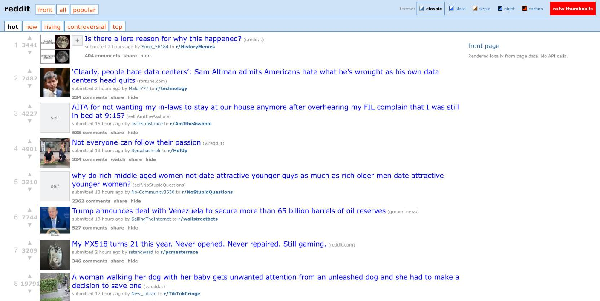
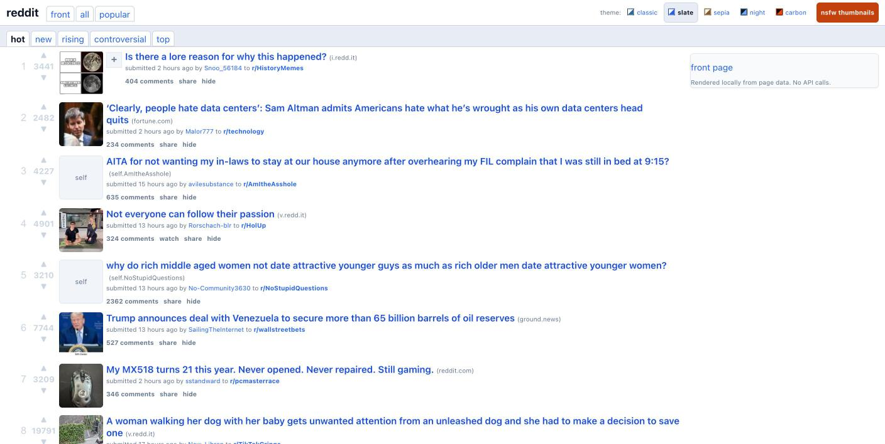
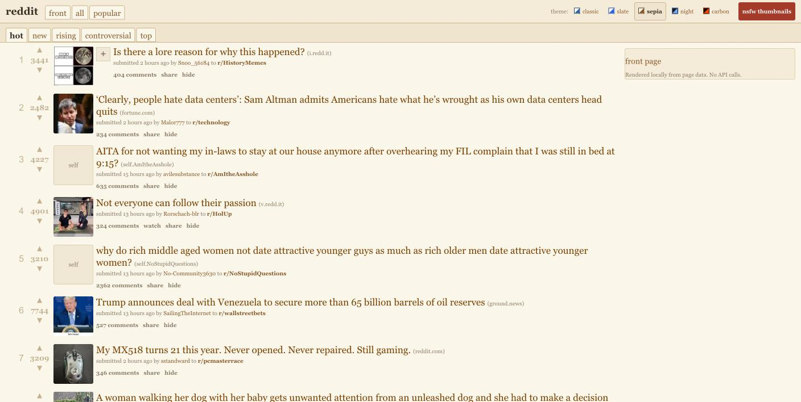
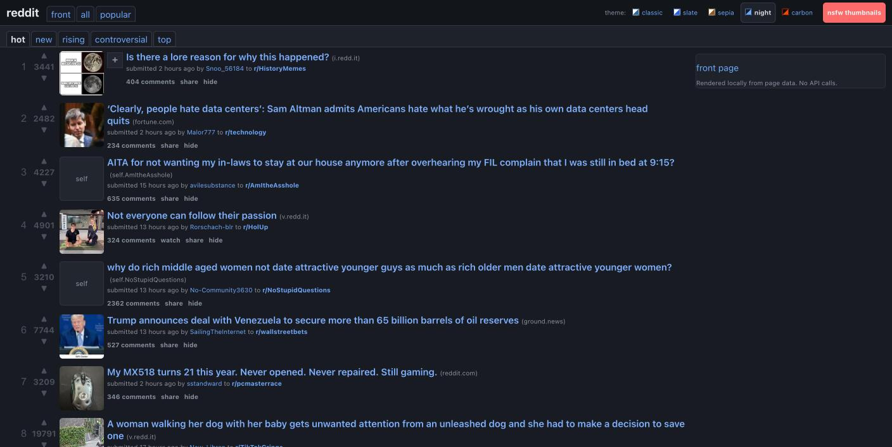
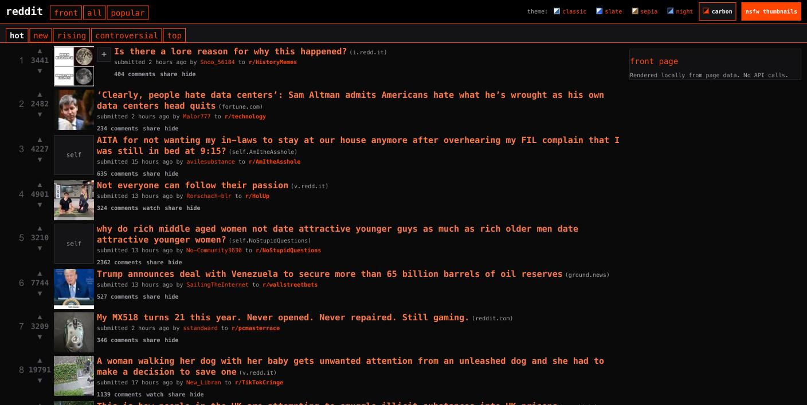

<div align="center">

<picture>
  <source media="(prefers-color-scheme: dark)" srcset="docs/assets/banner-dark.png">
  <source media="(prefers-color-scheme: light)" srcset="docs/assets/banner-light.png">
  
</picture>

### Shed the manipulative endless feed. Keep the conversation.

**Read Reddit without being read back.**

No account. No profile. No feed tuned to keep you scrolling.

[](#why)
[](#why)
[](#privacy)
[](#privacy)
[](#privacy)
[](#why)

[](CHANGELOG.md)
[](manifest.json)
[](#install)
[](#firefox)
[](LICENSE)

### Beta 0.32.0 is out — everyone is welcome to try it

Works in Chrome and Firefox, [installed by hand](#install) in about a minute.
If Sheddit makes Reddit better for you, tell a friend — or post about it on Reddit itself,
if you still have an account ;)

**[Bug reports](https://github.com/kookaburrabarrel/sheddit/issues/new/choose) are
genuinely wanted.** Reddit changes its code without notice, and a report from a page that
broke is the fastest way it gets fixed. [What changed](CHANGELOG.md).

<br>

**Five ways to read it, all of them content to let you leave — and none of them watching you read.**


<br><br>

**NSFW Support**<br>


</div>

---

## What it is

Sheddit is a browser extension that turns modern Reddit back into old Reddit, on every
page, while you stay logged out.

Reddit already sends your browser every post on the page. Sheddit takes those posts and
redraws them in the `old.reddit.com` layout: a ranked list of links you can scan, pick
from, and leave. It never logs in, never calls Reddit's API, and never sends anything
about you anywhere.

## Why

Old Reddit was a page of links, ranked by votes. You scanned it, picked something, and
left. What replaced it is a slot machine: an endless feed, tuned to you, built to keep you
on the page — with a data harvesting apparatus built on top.

Here is how the machine works. Every pause, every tap, every return visit and comment is
recorded into a profile of you. That profile is what Reddit sells to advertisers. Then
your feed is ranked against the profile to keep the session going — one more scroll, one
more belief reinforced, one more outrage, one more product placement. It is a cynical
lesson learned from Facebook and TikTok: a session that ends is a session that stops
producing.

Almost all of that needs you logged in. Your account is what ties every scroll and
hesitation to one durable profile that follows you across devices and years. Logged out,
the data scatters and the profile thins. Which may be why reading logged out keeps getting
harder:

- A login wall that rises half a minute into reading, with no close button and no way to
  dismiss it.
- `old.reddit.com` vanishing behind an account requirement for days at a stretch, with no
  announcement.
- The anonymous JSON API gated off entirely.

Whatever the intent, the effect is the same: reading without an account keeps getting
narrower.

**Sheddit is the opt-out.** It takes the page Reddit already sent your browser and
re-renders it locally into old Reddit's layout — no account, no credentials, and zero API
calls of its own. What you read is the list Reddit serves to a stranger: ranked by votes,
not by your profile, because there is no profile. The login wall is removed outright
rather than negotiated with. Nothing is recommended *to you*, nothing is harvested *from
you*, and the session ends when you decide it does.

What's left is a ranked list of links that stops when you do. Everything below is about
keeping that working on a site that has no reason to help.

### Why not just redirect to old.reddit.com?

|  | Works logged out | Needs your credentials | Survives an API policy change |
|---|:---:|:---:|:---:|
| **Redirect** to `old.reddit.com` | 🔴 not for long | 🔴 soon | 🔴 n/a — depends on Reddit continuing to host it |
| **Rebuild from the JSON API** | 🔴 no | 🔴 yes | 🔴 no |
| **Rebuild from the page** ← Sheddit | 🟢 yes | 🟢 no | 🟢 yes |

**Redirecting** works until Reddit decides it doesn't: `old.reddit.com` is being phased
out in stages, and the current stage is random, unannounced, site-wide login walls.
**Rebuilding from the API** needs your login, because Reddit blocks the anonymous API
(the [Classic Layout][cl] project documents this). **Rebuilding from the page** is what
Sheddit does. Everything it needs is already in the page Reddit just sent you, so there is
nothing to revoke, expire, or log into.

The catch is that Reddit can quietly rename the parts of its page Sheddit reads, whenever
it likes, and owes nobody notice when it does. That is why this project is free, open
source, and collaborative. When they change something, so will we.

[cl]: https://github.com/mkornreich/old_reddit

## Install

Version **0.32.0**, beta. It works and is tested on both browsers, Chrome more
thoroughly, but Reddit can change something tomorrow that breaks it. If that happens,
[tell me](https://github.com/kookaburrabarrel/sheddit/issues/new/choose). Store listings
are in progress; until they land, the zips below are the way in. Nothing to build.

### Chrome

**[⬇ Download sheddit.zip](https://github.com/kookaburrabarrel/sheddit/raw/main/dist/sheddit.zip)**

1. Unzip it. You get a `sheddit` folder with `manifest.json` inside.
2. **Move that folder somewhere permanent** — Documents is fine. Chrome reloads the
   extension from wherever you leave it, so a folder in Downloads disappears the day you
   clear Downloads.
3. Open `chrome://extensions`.
4. Turn on **Developer mode**, top right.
5. Click **Load unpacked** and pick the folder with `manifest.json` *directly* inside it —
   not the folder around that folder.
6. Open [reddit.com](https://www.reddit.com).

Chrome will warn about developer-mode extensions each time it starts. It says that about
anything installed outside the Web Store. Dismiss it.

**To update:** download the zip again, replace the folder's contents, then press ↻ on the
Sheddit card in `chrome://extensions`. A hand-installed extension never updates itself, so
the **updates** button in Sheddit's header turns orange once your copy is 30 days old, and
checks the current version when — and only when — you press it. Details in
[PRIVACY.md](PRIVACY.md#the-short-version).

Works in Chrome 111+ and any Chromium browser (Edge, Brave, Vivaldi, Opera).

### Firefox

**[⬇ Download sheddit-firefox.zip](https://github.com/kookaburrabarrel/sheddit/raw/main/dist/sheddit-firefox.zip)**

Same extension, newer build, fewer miles on it — bug reports from here are especially
useful. Until the addons.mozilla.org listing lands, Firefox 140+ only accepts it as a
*temporary* install, which lasts until the browser closes:

1. Open `about:debugging#/runtime/this-firefox`.
2. Click **Load Temporary Add-on…** and pick the zip. No need to unzip.

If reddit.com ever loads without the layout, Firefox has revoked the site permission. The
extension's options page will say so and offer a button to grant it back.

### From source

```bash
git clone https://github.com/kookaburrabarrel/sheddit.git
```

Then the Chrome steps above, pointing **Load unpacked** at the cloned folder. There is no
build step. See [CONTRIBUTING.md](CONTRIBUTING.md).

## What it does

|  |  |
|---|---|
| **The whole list at once** | Dense rows with rank, score, thumbnail, subreddit and tagline — around nine posts on a laptop screen |
| **Threading that reads like a conversation** | Indented comment trees with guide lines and `[–]` collapse toggles, plus old Reddit's sort menu |
| **Media without leaving the layout** | Video plays on the comments page, sound included; images and galleries render full size; listing rows get the `[+]` expando |
| **Scrolling that ends** | Uses Reddit's own pagination and stops when the feed is spent, instead of spinning to keep the session open |
| **Sorting that asks "of what span"** | `top` and `controversial` carry old Reddit's *links from* window — past hour through all time |
| **Five themes, no reload** | Switched from a button in the header; the choice follows you to every other tab |
| **Adult thumbnails, your call** | Flagged posts show old Reddit's placeholder tile by default; an *nsfw thumbnails* button in the header reveals them, and remembers |
| **Tells you when it breaks** | If Reddit ships markup Sheddit can't read, you get a screen saying so, with a button to hand the page back |
| **Nothing leaves your browser** | No API calls and no telemetry; your settings live in your browser's own storage and go nowhere else |

## Themes

Five palettes, switched from Sheddit's own header. A theme changes colour, type and
spacing, never the layout, and is applied before the page first paints, so a dark theme
never opens on a white flash.

<div align="center">

| classic | slate |
|:---:|:---:|
|  |  |
| old.reddit.com as it was — Verdana, blue links, square corners | the same layout softened — system font, muted greys, roomier rows |

| sepia | night |
|:---:|:---:|
|  |  |
| warm paper and serif type, for a long thread | dark, and deliberately softer than white-on-black |

| carbon |
|:---:|
|  |
| near-black, monospaced, Reddit orange, dense |

</div>

## How it works

Every post on a modern Reddit page carries its whole record — title, score, author, link —
as plain attributes on the page, while the visible parts are sealed where stylesheets
cannot reach. Sheddit reads those attributes, draws its own old-Reddit page alongside, and
hides the original. Every Reddit-specific name it depends on lives in one file, so a
Reddit redesign should only ever break one file.

Why it is built this way: [ARCHITECTURE.md](ARCHITECTURE.md).
How it is tested, in a real Chromium and a real Firefox: [TESTING.md](TESTING.md).
Every bug found so far, and what each one looked like:
[docs/engineering-log.md](docs/engineering-log.md).

## Scope

**Built for logged-out reading.** That is the case everything is tested against, so:

- **Voting isn't supported.** The arrows are drawn because old Reddit drew them, but they
  cannot reach Reddit's vote button without a login. Treat them as decoration.
- **Anything needing an account is left out.** No `save`, no `report`. Old Reddit didn't
  offer them logged out either.
- **Adult content is opt-in**, the way old Reddit did it: a placeholder tile in listings,
  and a blurred *click to view* on a post you open on purpose. Nothing loads until you ask.
- **Pages with no feed are handed straight back.** Age gates, private communities and
  rate-limit pages are left alone, so nothing covers the button you need.

**In:** the home feed, `/r/*` listings, comment pages, user profiles, header, sort tabs, the
`top`/`controversial` time window, sidebar.
**Out (for now):** search, modmail, chat, the post composer, and anything behind a login.

**Roadmap:** logged-in support, so the things an account unlocks — voting that votes,
saving, subscribed feeds — work without giving up an unprofiled read. Not started.

## Privacy

For most extensions this section is fine print. Here it is the point: an extension built
so you can read without being profiled had better not profile you itself, and had better
be checkable on that claim rather than taken at its word.

Sheddit makes **no API calls** — not to Reddit's, not to anyone else's. There is no
analytics, no telemetry, no remote configuration. Nothing about you is sent anywhere.

Exactly two requests ever leave the browser, both optional, neither about you:

- **A video manifest, to play video**, read from Reddit's media server without cookies —
  the same file your browser reads to play the video on Reddit. Untick *"Play video on
  the comments page"* and it never happens.
- **A version number, if you press the button that asks.** No cookies, no referrer, and
  never on its own. A check that ran by itself would make every install phone home with an
  IP and a timestamp, which is telemetry whatever it is called. The press is the consent.

It asks for two permissions: to run on `reddit.com`, and `storage` to remember your
theme. The tests count every request the extension makes, so a change that quietly
started fetching more would fail the build. Full policy in [PRIVACY.md](PRIVACY.md);
threat model in [SECURITY.md](SECURITY.md).

## Contributing

Contributions are welcome — especially **live findings**. GitHub's test machines cannot
see real Reddit, which serves datacenter IPs a bot-mitigation page instead. One
`npm run verify:live` from a home connection is often worth more than a patch. If Reddit
ships a redesign and Sheddit breaks, the fix is almost always in one file. Start at
[CONTRIBUTING.md](CONTRIBUTING.md).

## Documentation

| | |
|---|---|
| [ARCHITECTURE.md](ARCHITECTURE.md) | why it's built this way, and what was measured to get there |
| [docs/engineering-log.md](docs/engineering-log.md) | every bug found so far, and what each one looked like |
| [TESTING.md](TESTING.md) | how to test, and the traps worth knowing about |
| [OLD-REDDIT.md](OLD-REDDIT.md) | the measured spec of the site this imitates |
| [PRIVACY.md](PRIVACY.md) · [SECURITY.md](SECURITY.md) | what leaves your browser (two things), and the threat model |
| [CHANGELOG.md](CHANGELOG.md) | what changed, and what never worked |

## License

[GPL-3.0-or-later](LICENSE). You may use, study, share and modify Sheddit freely; if you
distribute a modified version, it has to stay free software too.

---

<div align="center">
<sub>Not affiliated with, endorsed by, or connected to Reddit, Inc.<br>
"Reddit" and the Reddit logo are trademarks of Reddit, Inc.</sub>
</div>

<div align="center">


</div>
